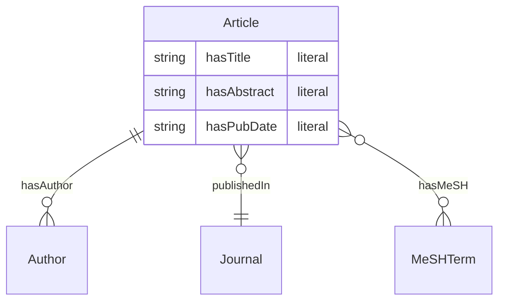

# 2. 클래스·속성 설계 (초급)

1번 `domain.md` 에서 정한 개념을 **클래스**와 **속성**으로 옮기세요.

## 클래스

| 클래스 | 설명 | 식별자 (인스턴스 구분용) |
|--------|------|---------------------------|
| Article | 논문 | PMID |
| Author | 저자 | lastname + forename (또는 author_id) |
| Journal | 저널 | 저널명 |
| MeSHTerm | MeSH 주제어 | MeSH 문자열 |

## 속성 (관계)

| 속성 | 도메인 (주체) | 범위 (대상) | JSON 출처 |
|------|----------------|-------------|-----------|
| hasTitle | Article | literal | title |
| hasAbstract | Article | literal | abstract |
| hasPubDate | Article | literal | pub_date |
| hasAuthor | Article | Author | authors[] |
| publishedIn | Article | Journal | journal |
| hasMeSH | Article | MeSHTerm | mesh_terms[] |

위 표를 필요하면 수정한 뒤, 3번에서 이 설계를 RDF/OWL 파일로 옮기세요.

---

## 클래스·속성 관계도 (Mermaid)

