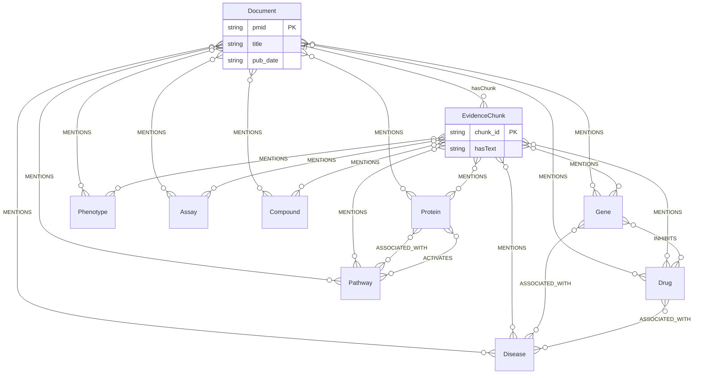

# 확장 온톨로지 설계 (중급)

데이터 원천: `02-intermediate/data/pubmed_distributed_200_cleansed.json` (PubMed 메타데이터 + 분배 모드 category).

---

## 반드시 들어가야 할 것

- **클래스**: Document, EvidenceChunk, Gene, Protein, Disease, Drug, Pathway, Phenotype, Assay, Compound
- **객체 속성**: hasChunk, MENTIONS, ASSOCIATED_WITH, INHIBITS, ACTIVATES
- **데이터 속성**: pmid, title, pub_date (Document); chunk_id, hasText (EvidenceChunk); name (생물의학 개체). 아래 표 참고.

---

## 클래스

| 클래스 | 설명 | 식별자 | JSON/원천 필드 |
|--------|------|--------|-----------------|
| Document | 논문 | pmid | `pmid` |
| EvidenceChunk | abstract/section 단위 | pmid + `_chunk_0` | 문서당 1청크 시 abstract 단위; 식별자 pmid 기반 |
| Gene | 유전자 | name 또는 gene_id | mesh_terms / title·abstract 추출 |
| Protein | 단백질 | name 또는 protein_id | mesh_terms / title·abstract 추출 |
| Disease | 질병 | name 또는 disease_id | mesh_terms (예: Neoplasms), title·abstract 추출 |
| Drug | 약물 | name 또는 drug_id | mesh_terms / title·abstract 추출 |
| Pathway | 경로 | name 또는 pathway_id | mesh_terms (예: Metabolic Networks and Pathways), 추출 |
| Phenotype | 표현형 | name 또는 phenotype_id | mesh_terms / 추출 |
| Assay | assay | name 또는 assay_id | mesh_terms / 추출 |
| Compound | 화합물 | name 또는 compound_id | mesh_terms / 추출 |

---

## 객체 속성 (관계)

| 속성 | 도메인 | 범위 | 비고 |
|------|--------|------|------|
| hasChunk | Document | EvidenceChunk | 1 Document : N EvidenceChunk. Neo4j :HAS_CHUNK 관계로 매핑 |
| MENTIONS | EvidenceChunk / Document | Gene, Protein, Disease, Drug, Pathway, Phenotype, Assay, Compound | 문헌/청크가 개체를 언급. mesh_terms→엔티티 매핑 또는 NER 추출로 채움 |
| ASSOCIATED_WITH | 생물의학 개체 전부 | 동일 (개체 간) | 개체 간 연관. 추출 또는 시뮬레이션. Neo4j 관계 프로퍼티: pmid, evidence_chunk_id ([../docs/neo4j-schema.md](../docs/neo4j-schema.md)). |
| INHIBITS | 생물의학 개체 전부 | 생물의학 개체 전부 | 스키마만 정의. 추출 결과가 있으면 채움. Neo4j 관계 프로퍼티: pmid, evidence_chunk_id ([../docs/neo4j-schema.md](../docs/neo4j-schema.md)). |
| ACTIVATES | 생물의학 개체 전부 | 생물의학 개체 전부 | 스키마만 정의. 추출 결과가 있으면 채움. Neo4j 관계 프로퍼티: pmid, evidence_chunk_id ([../docs/neo4j-schema.md](../docs/neo4j-schema.md)). |

---

## 데이터 속성 (정의할 목록)

| 속성 | 도메인 | 타입 | JSON/원천 |
|------|--------|------|------------|
| pmid | Document | xsd:string | `pmid` |
| title | Document | xsd:string | `title` |
| pub_date | Document | xsd:string | `pub_date` (또는 date 형) |
| chunk_id | EvidenceChunk | xsd:string | pmid 기반 생성 (예: `{pmid}_chunk_0`) |
| hasText | EvidenceChunk | xsd:string | `abstract` |
| name | Gene, Protein, Disease, Drug, Pathway, Phenotype, Assay, Compound | xsd:string | mesh_terms 또는 추출된 엔티티명 |

---

## 클래스·관계 구조도 (Mermaid)

- **문헌 계층**: Document → hasChunk → EvidenceChunk.
- **MENTIONS**: Document / EvidenceChunk → Gene, Protein, Disease, Drug, Pathway, Phenotype, Assay, Compound (도메인·범위는 `evidence_kg_ontology.ttl`의 BiomedicalEntity로 통합 가능).
- **ASSOCIATED_WITH / INHIBITS / ACTIVATES**: 생물의학 개체 간; 위 다이어그램에는 일부 예시만 표기.

---

## 값 채움 이유 및 원천 소스

### 클래스 식별자

| 클래스 | 채워진 값 | 왜 그런가 | 원천 소스 |
|--------|-----------|-----------|------------|
| Document | pmid | 논문을 전 세계적으로 유일하게 구분하는 PubMed ID를 쓰면 중복·충돌이 없음. | JSON 필드 `pmid` (PubMed E-utilities efetch 응답) |
| EvidenceChunk | pmid + `_chunk_0` | 현재 데이터는 문서당 청크 1개(초록 전체). 청크 인스턴스를 구분하려면 문서(pmid)와 인덱스가 필요함. `_chunk_0`으로 확장 가능. | JSON에는 청크 컬럼 없음 → 규칙: 1 Document = 1 EvidenceChunk, 내용은 `abstract` |
| Gene, Protein, Disease, Drug, Pathway, Phenotype, Assay, Compound | name 또는 *_id | 실제 데이터에 엔티티 테이블이 없음. MeSH·추출 결과를 "이름" 또는 나중에 부여한 id로 식별. | `mesh_terms` (MeSH 문자열), title/abstract NER·추출, 또는 시뮬레이션 id |

### 객체 속성 도메인/범위

| 속성 | 채워진 값 | 왜 그런가 | 원천 소스 |
|------|-----------|-----------|------------|
| hasChunk | 도메인 Document / 범위 EvidenceChunk | 문헌 계층 1:N. 1 Document가 N개의 청크를 가짐. Neo4j :HAS_CHUNK로 매핑. | JSON 1 Document = 1 abstract 청크 → 규칙으로 pmid_chunk_0 생성 후 연결 |
| MENTIONS | 도메인 Document, EvidenceChunk / 범위 생물의학 개체 전부 | domain.md: "EvidenceChunk/Document가 개체를 언급". 문헌·청크 → 개체 방향 관계. | MENTIONS 관계: mesh_terms를 Disease/Pathway 등으로 매핑하거나, title/abstract에서 엔티티 추출 후 연결 |
| ASSOCIATED_WITH | 도메인·범위 모두 생물의학 개체 | domain.md: "개체 간 연관". 동일 타입/다른 타입 간 모두 가능하므로 도메인·범위를 개체 클래스들의 합으로 둠. | 추출 결과 또는 시뮬레이션. JSON에는 명시적 관계 없음. |
| INHIBITS, ACTIVATES | 도메인·범위: Gene, Protein, Drug 등 → Gene, Protein, Pathway 등 | "스키마만 정의"이므로 구체 인스턴스는 나중에. 주체·대상이 생물의학 개체이므로 도메인/범위를 그렇게 둠. | 추출 단계에서만 채움. 현재 JSON에는 없음. |

### MENTIONS 관계: 출처 프로퍼티를 두지 않는 이유 (Neo4j 스키마 선택)

Neo4j에서 MENTIONS 관계에 `source: "document" | "chunk"` 같은 **관계 프로퍼티는 넣지 않기로 함**. 이유는 아래와 같다.

- **스키마 최소주의**: 그래프에서는 “필요할 때만” 프로퍼티를 두는 편이 장기적으로 유리하다. 관계 프로퍼티를 한 번 넣으면 **마이그레이션**, **인덱스/제약 관리**, **데이터 적재 규칙**, **문서화·검증** 등 운영 부담이 늘어난다.
- **구조로 이미 해결됨**: “문서에서 나온 언급” vs “청크에서 나온 언급”은 **관계의 시작 노드**가 Document인지 EvidenceChunk인지로 구분할 수 있다. `source`는 “있으면 편할 수도 있는” 수준이고, 구조만으로 해결되는 문제라 처음부터 넣을 가치가 낮다.

따라서 MENTIONS는 **관계 프로퍼티 없음**으로 정의하고, ASSOCIATED_WITH / INHIBITS / ACTIVATES만 관계 출처(pmid, evidence_chunk_id) 프로퍼티를 둔다(Neo4j 스키마는 `docs/neo4j-schema.md` 참고).  
**관계 출처(pmid, evidence_chunk_id)는 Neo4j 스키마·입력 형식에서만 정의하며, `evidence_kg_ontology.ttl`에는 객체/데이터 속성으로 추가하지 않는다.**

위 표와 구조도를 바탕으로 RDF/OWL 파일 `evidence_kg_ontology.ttl`에 반영하면 됩니다. (2-1 완료 후 2-2에서 데이터 속성·클래스 정의 일치 여부를 점검.)
